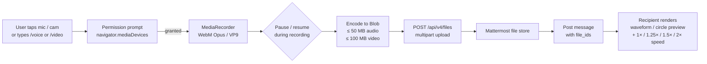

# Mattermost Voice & Video Clips

[](https://github.com/mikhailartamonov/MattermostVoiceClips/actions/workflows/ci.yml)
[](https://github.com/mikhailartamonov/MattermostVoiceClips/releases/latest)
[](https://mattermost.com)
[](LICENSE)

Cross-platform voice and video messaging plugin for Mattermost with full support for web, desktop, iOS and Android.

## Recording → playback flow



Recording happens entirely in the browser — the plugin never proxies
the audio. Only the final encoded Blob crosses the wire, via the
standard Mattermost file-upload API. iOS Safari 14.3+ and Android
Chrome both expose `MediaRecorder`, so the same code path works on
mobile, desktop and web.

## Features

### Voice Messages
- **Cross-platform**: Works on web, desktop, iOS (Safari 14.3+) and Android (Chrome)
- **Easy recording**: Intuitive recording interface with pause/resume
- **Quality audio**: Uses WebM (Opus codec) for optimal quality and size
- **Waveform visualization**: Audio waveform display during playback
- **Smart player**: Speed control (1x, 1.25x, 1.5x, 2x), seeking
- **Slash command**: Quick access via `/voice`

### Video Messages
- **Video recording**: Camera recording with real-time circular preview (Telegram-style)
- **High quality**: VP9/VP8 codec for excellent quality at small file sizes
- **Mobile support**: Works on all mobile devices
- **Recording controls**: Pause, resume, cancel
- **Slash command**: Quick access via `/video`

### General
- **Mobile-first design**: Fully responsive interface for mobile devices
- **Security**: Proper permission requests for camera and microphone
- **Validation**: File type, size (up to 50 MB audio, 100 MB video), permissions
- **Internationalization**: 12 languages supported (auto-detects system language)
- **Notifications**: Custom notification sounds for incoming voice/video messages

## Why This Plugin?

The existing [mattermost-plugin-voice](https://github.com/streamer45/mattermost-plugin-voice) has a critical limitation: it only works on web and desktop clients, with **no mobile device support**.

**Voice & Video Clips** solves this by using the modern MediaRecorder API, supported in all mobile browsers:
- iOS Safari 14.3+
- Android Chrome
- Mattermost mobile apps (via WebView)

## Requirements

- Mattermost Server 7.1.0 or higher
- Go 1.19+ (for building)
- Node.js 18+ (for building)

## Installation

### From Pre-built Package

1. Download the latest release from [Releases](https://github.com/mikhailartamonov/MattermostVoiceClips/releases)
2. In Mattermost, go to **System Console** > **Plugins** > **Plugin Management**
3. Click **Upload Plugin** and select the downloaded `.tar.gz` file
4. Enable the plugin

### Building from Source

```bash
git clone https://github.com/mikhailartamonov/MattermostVoiceClips.git
cd MattermostVoiceClips
make dist
# Plugin is created at dist/com.mattermost.voice-clips-<version>.tar.gz
# where <version> is read from plugin.json (no manual sync needed).
```

## Usage

### Recording Voice Messages

1. Click the microphone icon in the channel header
2. Allow microphone access (first time only)
3. Click **Start Recording**
4. Use controls: Pause, Resume, Stop & Send, Cancel

Or use the slash command: `/voice`

### Recording Video Messages

1. Click the video icon in the channel header
2. Allow camera and microphone access (first time only)
3. Click **Start Recording**
4. Use controls: Pause, Resume, Stop & Send, Cancel

Or use the slash command: `/video`

### Playback

- Play/pause controls
- Waveform visualization (audio)
- Circular video display
- Seek by clicking on progress bar
- Playback speed control (1x, 1.25x, 1.5x, 2x)

## Configuration

Configure in **System Console** > **Plugins** > **Voice & Video Clips**:

- **Audio duration**: Max recording length (default: 5 minutes)
- **Video duration**: Max recording length (default: 2 minutes)
- **File sizes**: Max upload sizes (default: 50 MB audio, 100 MB video)
- **Bitrates**: Audio (64-256 kbps), Video (500-4000 kbps)
- **Formats**: Allowed file formats
- **Waveform**: Enable/disable visualization

See [Configuration Guide](doc/CONFIGURATION.md) for details.

## Browser Support

| Platform | Browser | Support |
|----------|---------|---------|
| Desktop | Chrome/Edge | Full |
| Desktop | Firefox | Full |
| Desktop | Safari | Full |
| iOS | Safari 14.3+ | Full |
| Android | Chrome | Full |
| Mobile App | WebView | Full |

## Documentation

- [Installation Guide](doc/INSTALLATION.md)
- [Configuration Guide](doc/CONFIGURATION.md)
- [Architecture Overview](doc/ARCHITECTURE.md)
- [Development Guide](doc/DEVELOPMENT.md)
- [API Reference](doc/API.md)

## Supported Languages

The plugin automatically detects your system language:

- English, Russian, German, French, Spanish, Portuguese
- Chinese, Japanese, Korean, Italian, Dutch, Polish

## Development

```bash
# Install dependencies
cd webapp && npm install

# Build plugin
make dist

# Watch mode (auto-rebuild)
make watch

# Run tests
cd server && go test -v ./...
```

See [Development Guide](doc/DEVELOPMENT.md) for more details.

## Known Issues

- iOS Safari may require user interaction before first microphone permission request
- Old browsers (< 2020) may not support MediaRecorder API

## Mattermost compatibility

| Server   | Status   |
|----------|----------|
| 7.1.x    | Floor declared in `plugin.json`; older versions refuse to load the plugin |
| 7.x – 10.x | Supported — only stable public APIs (`pluginapi.Client`, `API.UploadFile`/`CreatePost`/`HasPermissionToChannel`/`RegisterCommand`/`PublishWebSocketEvent`, webapp `registerChannelHeaderButtonAction`/`registerPostTypeComponent`/`registerWebSocketEventHandler`/`registerRootComponent`) are used |
| Mobile   | Mattermost Mobile 2.x+ on iOS 14.3+ / modern Android (recording uses WebView + `MediaRecorder`) |

Built against `github.com/mattermost/mattermost/server/public v0.1.1`; server binaries are cross-compiled for Linux amd64/arm64, macOS amd64/arm64, Windows amd64.

## Roadmap

### Shipped

- [x] Cross-platform recording — web, desktop, iOS Safari 14.3+, Android Chrome
- [x] Audio: WebM/Opus, OGG/Opus, MP4/AAC, plus MP3 / WAV fallbacks
- [x] Video: WebM/VP9 + VP8, MP4/H.264 fallback, Telegram-style circular preview
- [x] Pause / resume during recording (where the browser supports it)
- [x] Playback: waveform visualization, seek, 1× / 1.25× / 1.5× / 2× speed
- [x] Slash commands `/voice` and `/video`
- [x] System Console settings: durations, file-size caps, bitrates, allowed formats, waveform toggle
- [x] i18n (12 languages, system-language auto-detect)
- [x] Notification sound on incoming clips
- [x] Multi-platform server binaries (Linux amd64/arm64, macOS amd64/arm64, Windows amd64) via GitHub Actions auto-release
- [x] **v0.4.1** — pre-built `.tar.gz` published on every push to `master`; auto-tag from `plugin.json` version
- [x] **v0.4.2** — hardened upload path (size cap from config, early auth, structured logging for orphaned files); auth required on `/api/v1/config`; double-mic-prompt fixed on mobile Safari; race guard on max-duration auto-stop; webapp ESLint config restored; all known dependency CVEs patched (`grpc`, `golang.org/x/crypto`, `minimatch`, `postcss`, `ajv`)

### Planned (next minor)

- [ ] Drag-to-cancel gesture during recording (Telegram-style swipe-left)
- [ ] Lock-to-record toggle so the mic stays open without holding the button on mobile
- [ ] Reply / quote support for `custom_voice_clip` and `custom_video_clip` post types
- [ ] Per-channel enable/disable from channel settings
- [ ] Wire `npm run lint` into the CI Lint job as a blocking gate (currently only `golangci-lint` blocks)

### Under consideration

- [ ] Server-side transcription hook (Whisper / external API), surfaced as searchable post metadata
- [ ] Background-noise suppression beyond the browser default
- [ ] Per-user preferred bitrate preset
- [ ] Accessibility pass — keyboard-only recording flow, ARIA live regions for state

Open an [issue](https://github.com/mikhailartamonov/MattermostVoiceClips/issues) or PR if you want to nudge anything up the list.

## License

MIT License - see [LICENSE](LICENSE)

## Contributing

Pull requests welcome! For major changes, please open an issue first to discuss.

## Support

If you have issues or questions:
1. Check [Issues](https://github.com/mikhailartamonov/MattermostVoiceClips/issues)
2. Create a new issue with description
3. Include Mattermost version, browser, and OS

## Acknowledgments

- [mattermost-plugin-voice](https://github.com/streamer45/mattermost-plugin-voice) - for inspiration
- [mattermost-plugin-calls](https://github.com/mattermost/mattermost-plugin-calls) - for cross-platform examples
- Mattermost community for excellent plugin development documentation
